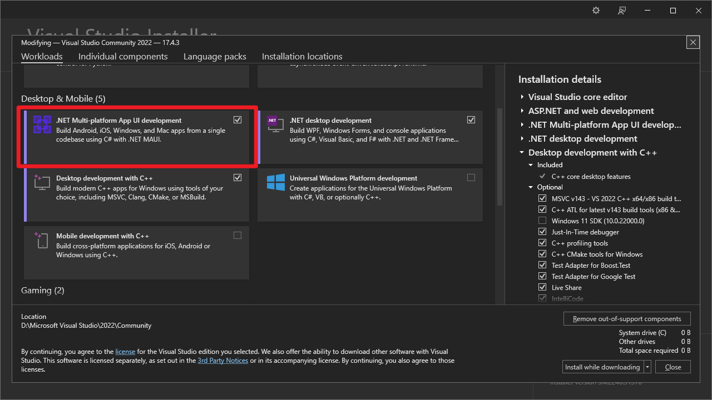

# Contributing

EscapeWild.Forms is an Xamarin.Forms project and only works on Android,
at least, UWP and iOS are not available during our development.
It's very appreciated if you could contribute code for other platforms.

- If you want to do localization, see [localization](#Localization)
- If you want to build EscapeWild.Forms, see [building guide](#how-to-build)

## How to build

First of all, you should install Visual Studio and `.NET Multi-platform App UI development` payload.



To cut a long story short, please see
the [get started with Visual Studio ](https://learn.microsoft.com/en-us/xamarin/get-started/first-app/?pivots=windows-vs2022)
from Microsoft to get more information.

If you want to release your own one, you
should [specify the Android keystore with Visual Studio](https://learn.microsoft.com/en-us/xamarin/android/deploy-test/signing/?tabs=windows).

## Localization

### Structure

EscapeWild.Forms will retrieve localization in a `Dictionary<string,string>`,
more especially, you need to implement the interface, `ILocalization`.

Conventionally, the localization subclass should be placed
under [Localization folder](WildernessSurvival/WildernessSurvival/Localization).

And then, to register the localization
in [the constructor of class App](WildernessSurvival/WildernessSurvival/App.xaml.cs).

### Not familiar with C#?

If you were not familiar with C#, you could follow the operation below.

#### Your language doesn't appear?

If your language doesn't appear under [Localization folder](WildernessSurvival/WildernessSurvival/Localization),
you can follow this step-by-step guide.

1. Copy the [En.cs](WildernessSurvival/WildernessSurvival/Localization/En.cs) in Localization folder,
   and paste in the same folder with a different name, for example,
   if the target language is French, you should rename it to `Fr.cs`.

2. Rename this class to `Lang+Language`, such as `LangFr`.

3. Change it's `BoundCulture` to the target language, for example:

   ```csharp
   public CultureInfo BoundCulture { get; } = new CultureInfo("fr");
   ```

4. Now do the localization! Just translate all English words in the large dictionary to the target language.
5. Finally, register the localization
   in [the constructor of class App](WildernessSurvival/WildernessSurvival/App.xaml.cs).
   ```csharp
   I18N.EnableFallbackToDefault = true;
   I18N.RegisterLocalization(new LangEn(), isDefault: true);
   I18N.RegisterLocalization(new LangFr());
   ``` 

#### Continue an existed localization

If your language has been added under [Localization folder](WildernessSurvival/WildernessSurvival/Localization),
but it lacks further localization, you can follow this step-by-step guide.

1. Find it under [Localization folder](WildernessSurvival/WildernessSurvival/Localization).
   Conventionally, it should be named as `Lang+Language`, such as `LangFr`.
2. Now do the localization! For missing words in the large dictionary, you can just copy from
   the [default `en` localization](WildernessSurvival/WildernessSurvival/Localization/En.cs).