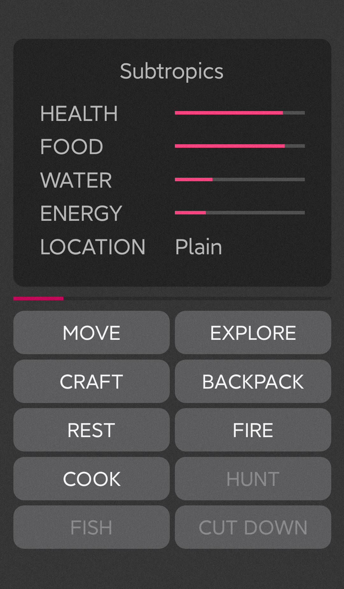

# Escape Wild

[![Button Discord]][Discord]
[![Buttons Download]][Download]

#### *A text-based game powered by Xamarin.Forms*

### NOTE: [EscapeWild.Flutter](https://github.com/liplum/EscapeWild.Flutter) is a new Escape Wild rewritten in Dart with Flutter.

## Licence

EscapeWild.Forms is open source under GUN v3.0 license.

## Contributing

Welcome to contribute localization, or add more content.

Please see [this contribution guide](CONTRIBUTING.md) to get started.

## Acknowledgements

<!----------------------------------------------------------------------------->

[Discord]: https://discord.gg/PDwyxM3waw
[Download]: https://github.com/liplum/EscapeWild.Forms/releases/latest

<!---------------------------------[ Buttons ]--------------------------------->

[Button Discord]: https://img.shields.io/discord/937228972041842718?color=454fc1&label=Discord&logo=Discord&style=for-the-badge&logoColor=white&labelColor=5865F2
[Buttons Download]: https://img.shields.io/github/downloads/liplum/EscapeWild.Forms/total?color=023a46&label=Download&logo=docusign&logoColor=white&style=for-the-badge&labelColor=034e5e
