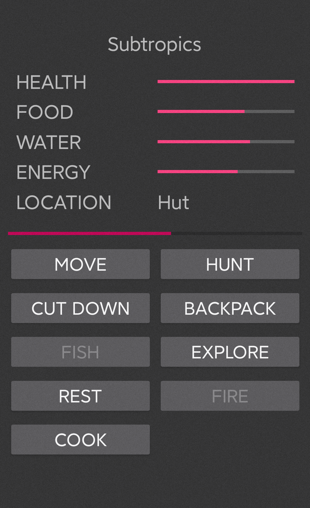

# Escape Wild

#### *A text-based game powered by Xamarin.Forms*

#### *It's a prototype of an oncoming game.*

### See Also

[escape_wild_flutter](https://github.com/liplum/escape_wild_flutter) is the new Escape Wild rewritten in Dart and Flutter.

## Licence

EscapeWild.Forms is open source under GUN v3.0 license.

## Contributing

Welcome to contribute localization, or add more content.

Please see [this contribution guide](CONTRIBUTING.md).

## Acknowledgements

